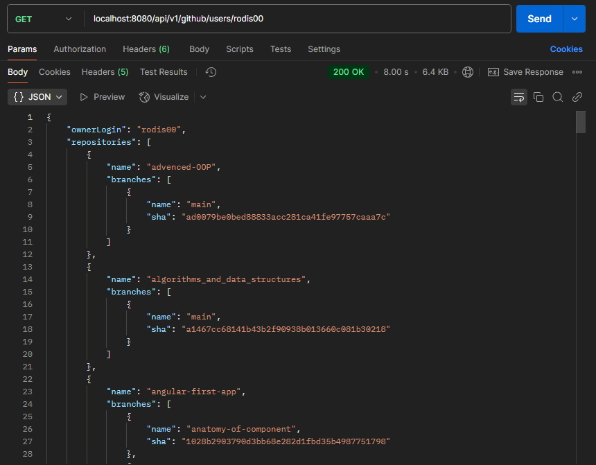
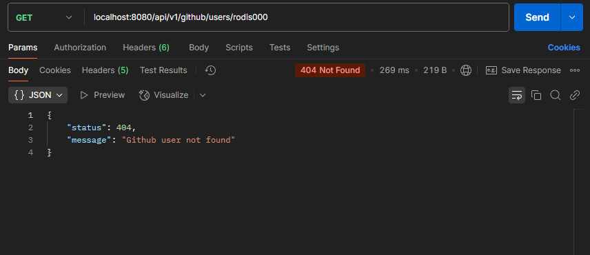

# Overwiew

Spring Boot REST API created to fetch user information from Github API.  
The received data includes user public repositories with their branches and last commit sha.

### Available endpoint to fetch data
```localhost:8080/api/v1/github/users/{username}```

The **username** variable is your github's username.  

> [!Note]
> The Github API has a day request limit


### Example received data for existing user



### If user is not found the API throws an error

